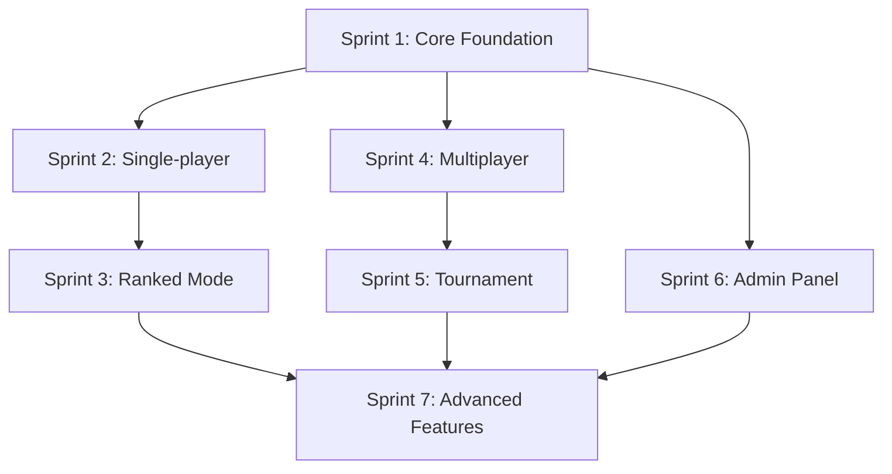

# Bible Quiz - Sprint Planning

## Tổng quan
Dự án được chia thành **7 Sprint** theo độ ưu tiên và phụ thuộc, tổng thời gian ước tính: **16-22 tuần (4-5.5 tháng)**

---

## 🏗️ **Sprint 1: Core Foundation** (2-3 tuần)
**Mục tiêu**: Thiết lập nền tảng cơ bản

### Backend Tasks
- [ ] Database schema (MySQL + Flyway migrations)
  - [ ] User, AuthIdentity, Question, QuizSession, Answer tables
  - [ ] Indexes và constraints theo SPEC
  - [ ] Seed data cơ bản (books, sample questions)
- [ ] JPA entities và repositories
  - [ ] User, Question, QuizSession, Answer entities
  - [ ] Repository interfaces với custom queries
- [ ] Authentication system
  - [ ] OAuth2 (Google/Facebook) integration
  - [ ] JWT token generation & validation
  - [ ] Spring Security configuration
- [ ] Basic REST APIs
  - [ ] `/auth/oauth/*` - OAuth endpoints
  - [ ] `/auth/refresh`, `/auth/logout`
  - [ ] `/me` - User profile
  - [ ] `/books` - List books
  - [ ] `/questions` - Question listing & filtering
- [ ] Error handling & validation
- [ ] CORS configuration

### Frontend Tasks
- [ ] React project setup (Vite + TypeScript)
- [ ] Routing structure
- [ ] Basic UI components (Button, Input, Card)
- [ ] API client setup (Axios)
- [ ] Authentication flow
- [ ] Basic pages: Home, Login, Profile

### DevOps Tasks
- [ ] Docker Compose cho local development
- [ ] Environment configuration
- [ ] Basic CI/CD pipeline

### Acceptance Criteria
- [ ] User có thể đăng nhập qua Google/Facebook
- [ ] API trả về danh sách sách và câu hỏi
- [ ] Frontend hiển thị được câu hỏi cơ bản
- [ ] Local development environment hoạt động

---

## 🎯 **Sprint 2: Single-player & Practice Mode** (2-3 tuần)
**Mục tiêu**: Chế độ chơi cá nhân cơ bản

### Backend Tasks
- [ ] Quiz session management
  - [ ] `POST /sessions` - Create session
  - [ ] `POST /sessions/{id}/answer` - Submit answer
  - [ ] `GET /sessions/{id}` - Session status
  - [ ] `GET /sessions/{id}/review` - Review answers
- [ ] Question selection logic
  - [ ] Filter by book, difficulty, tags
  - [ ] Random selection with seed
  - [ ] Exclude already answered questions
- [ ] Scoring system
  - [ ] Basic scoring (10 points per correct answer)
  - [ ] Speed bonus calculation
  - [ ] Answer validation logic
- [ ] Practice mode implementation
  - [ ] Unlimited questions
  - [ ] No leaderboard impact
  - [ ] Personal history saving

### Frontend Tasks
- [ ] Quiz interface
  - [ ] Question display component
  - [ ] Answer selection (multiple choice, true/false)
  - [ ] Timer component
  - [ ] Progress indicator
- [ ] Practice mode UI
  - [ ] Configuration form (books, difficulty, count)
  - [ ] Retry last set functionality
  - [ ] Show/hide explanations toggle
- [ ] Results & review
  - [ ] Score display
  - [ ] Answer review with explanations
  - [ ] Session history

### Acceptance Criteria
- [ ] User có thể chơi practice mode với cấu hình tùy chọn
- [ ] Hệ thống chấm điểm chính xác
- [ ] User có thể xem lại kết quả và giải thích
- [ ] Practice mode không ảnh hưởng leaderboard

---

## 🏆 **Sprint 3: Ranked Mode & Leaderboard** (2-3 tuần)
**Mục tiêu**: Hệ thống xếp hạng

### Backend Tasks
- [ ] Ranked mode logic
  - [ ] Daily limits (50 questions, 10 lives)
  - [ ] Lives deduction on wrong answers
  - [ ] Points counting only when lives > 0
- [ ] Book progression system
  - [ ] Fixed order: Genesis → Revelation
  - [ ] Auto-advance to next book
  - [ ] Post-cycle hard questions
- [ ] UserDailyProgress tracking
  - [ ] Daily reset mechanism
  - [ ] Progress persistence
  - [ ] Status API (`GET /me/ranked-status`)
- [ ] Leaderboard system
  - [ ] Daily/Weekly/All-time leaderboards
  - [ ] Ranking calculation
  - [ ] Leaderboard APIs
- [ ] Difficulty escalation
  - [ ] Post-cycle hard questions
  - [ ] Fallback to medium/easy if needed

### Frontend Tasks
- [ ] Ranked mode UI
  - [ ] Ranked status display
  - [ ] Lives counter
  - [ ] Questions counted (x/50)
  - [ ] Current book indicator
- [ ] Leaderboard pages
  - [ ] Global leaderboard
  - [ ] Personal ranking
  - [ ] Period selection (daily/weekly/all-time)
- [ ] Ranked quiz flow
  - [ ] Locked book selection
  - [ ] Special UI for ranked mode

### Acceptance Criteria
- [ ] Ranked mode hoạt động với 50 câu/ngày, 10 mạng
- [ ] Book progression tự động từ Genesis → Revelation
- [ ] Post-cycle hard questions được phục vụ
- [ ] Leaderboard hiển thị chính xác
- [ ] Daily reset hoạt động đúng

---

## 🎮 **Sprint 4: Multiplayer Rooms & WebSocket** (3-4 tuần)
**Mục tiêu**: Chơi nhiều người realtime

### Backend Tasks
- [ ] Room management
  - [ ] `POST /rooms` - Create room
  - [ ] `POST /rooms/{id}/join` - Join room
  - [ ] `POST /rooms/{id}/start` - Start quiz
  - [ ] `GET /rooms/{id}` - Room status
- [ ] WebSocket implementation
  - [ ] Spring WebSocket configuration
  - [ ] Room channels (`/ws/rooms/{id}`)
  - [ ] Real-time events (join, ready, answer, leave)
- [ ] Room state management
  - [ ] Room lifecycle (lobby → in_progress → ended)
  - [ ] Player synchronization
  - [ ] Question distribution
- [ ] Real-time scoring
  - [ ] Live score updates
  - [ ] Scoreboard broadcasting
  - [ ] Room leaderboard

### Frontend Tasks
- [ ] Room creation & joining
  - [ ] Create room form
  - [ ] Join room by code
  - [ ] Room settings configuration
- [ ] Multiplayer quiz interface
  - [ ] Real-time question display
  - [ ] Live scoreboard
  - [ ] Player list
  - [ ] Room status indicators
- [ ] WebSocket integration
  - [ ] Connection management
  - [ ] Event handling
  - [ ] Reconnection logic

### Acceptance Criteria
- [ ] Host có thể tạo phòng và chia sẻ mã
- [ ] Players có thể join phòng qua mã
- [ ] Quiz chạy đồng bộ cho tất cả players
- [ ] Scoreboard cập nhật real-time
- [ ] WebSocket connection ổn định

---

## 🏟️ **Sprint 5: Tournament Mode** (2-3 tuần)
**Mục tiêu**: Giải đấu loại trực tiếp

### Backend Tasks
- [ ] Tournament management
  - [ ] `POST /tournaments` - Create tournament
  - [ ] `POST /tournaments/{id}/join` - Join tournament
  - [ ] `POST /tournaments/{id}/start` - Start tournament
  - [ ] Bracket generation logic
- [ ] Match system
  - [ ] 1v1 match creation
  - [ ] 3 lives per player per match
  - [ ] Match state management
  - [ ] Tie-break logic
- [ ] Tournament WebSocket events
  - [ ] Tournament state updates
  - [ ] Match start/end events
  - [ ] Bracket updates
- [ ] Bye handling
  - [ ] Odd number of participants
  - [ ] Automatic advancement

### Frontend Tasks
- [ ] Tournament creation
  - [ ] Tournament settings form
  - [ ] Participant management
- [ ] Bracket UI
  - [ ] Tournament bracket display
  - [ ] Match status indicators
  - [ ] Progress tracking
- [ ] Match interface
  - [ ] 1v1 match display
  - [ ] Lives counter for both players
  - [ ] Match result display
- [ ] Spectator mode
  - [ ] Watch ongoing matches
  - [ ] Tournament overview

### Acceptance Criteria
- [ ] Tournament bracket được tạo tự động
- [ ] 1v1 matches hoạt động với 3 mạng/người
- [ ] Bracket cập nhật real-time
- [ ] Bye handling cho số người lẻ
- [ ] Spectator có thể xem matches

---

## 👨‍💼 **Sprint 6: Admin Panel & AI Generator** (3-4 tuần)
**Mục tiêu**: Quản lý nội dung

### Backend Tasks
- [ ] Admin authentication & authorization
  - [ ] Role-based access control
  - [ ] Admin-only endpoints
- [ ] Question management
  - [ ] `POST /admin/questions` - Create question
  - [ ] `PUT /admin/questions/{id}` - Update question
  - [ ] `DELETE /admin/questions/{id}` - Delete question
  - [ ] Question validation
- [ ] Import system
  - [ ] CSV/JSON import
  - [ ] Dry-run functionality
  - [ ] Batch processing
- [ ] AI Question Generator
  - [ ] AWS Bedrock integration
  - [ ] `POST /admin/ai/generate` - Generate questions
  - [ ] `GET /admin/ai/jobs/{id}` - Job status
  - [ ] Draft management & approval
- [ ] Feedback management
  - [ ] `GET /admin/feedback` - List feedback
  - [ ] `PATCH /admin/feedback/{id}` - Update status
- [ ] Analytics
  - [ ] Question usage statistics
  - [ ] User activity metrics
  - [ ] Performance dashboards

### Frontend Tasks
- [ ] Admin authentication
  - [ ] Admin login flow
  - [ ] Role-based UI access
- [ ] Question management UI
  - [ ] Question CRUD forms
  - [ ] Question list with filters
  - [ ] Bulk operations
- [ ] AI Generator interface
  - [ ] Scripture input form
  - [ ] Prompt customization
  - [ ] Generation progress
  - [ ] Draft review & approval
- [ ] Import interface
  - [ ] File upload
  - [ ] Preview & validation
  - [ ] Import progress
- [ ] Analytics dashboard
  - [ ] Charts & graphs
  - [ ] Export functionality

### Acceptance Criteria
- [ ] Admin có thể CRUD questions
- [ ] AI Generator tạo được questions từ scripture
- [ ] Import system hoạt động với CSV/JSON
- [ ] Analytics dashboard hiển thị metrics
- [ ] Feedback được quản lý hiệu quả

---

## ✨ **Sprint 7: Advanced Features & Polish** (2-3 tuần)
**Mục tiêu**: Hoàn thiện & tối ưu

### Backend Tasks
- [ ] Bookmark system
  - [ ] `POST /me/bookmarks` - Add bookmark
  - [ ] `DELETE /me/bookmarks/{id}` - Remove bookmark
  - [ ] `GET /me/bookmarks` - List bookmarks
- [ ] Advanced analytics
  - [ ] User behavior tracking
  - [ ] Question difficulty analysis
  - [ ] Retention metrics
- [ ] Performance optimization
  - [ ] Database query optimization
  - [ ] Caching strategy
  - [ ] API response optimization
- [ ] Error handling & logging
  - [ ] Comprehensive error handling
  - [ ] Structured logging
  - [ ] Monitoring & alerting
- [ ] Testing
  - [ ] Unit tests
  - [ ] Integration tests
  - [ ] E2E tests
- [ ] Security hardening
  - [ ] Rate limiting
  - [ ] Input validation
  - [ ] Security headers

### Frontend Tasks
- [ ] Bookmark functionality
  - [ ] Bookmark questions
  - [ ] Bookmark management
  - [ ] Bookmark filtering
- [ ] Advanced UI features
  - [ ] Dark mode
  - [ ] Responsive design
  - [ ] Accessibility improvements
  - [ ] Loading states & skeletons
- [ ] Performance optimization
  - [ ] Code splitting
  - [ ] Lazy loading
  - [ ] Image optimization
- [ ] User experience
  - [ ] Smooth animations
  - [ ] Better error messages
  - [ ] Offline support
- [ ] Testing
  - [ ] Component tests
  - [ ] E2E tests
  - [ ] Visual regression tests

### DevOps Tasks
- [ ] Production deployment
  - [ ] AWS infrastructure setup
  - [ ] CI/CD pipeline
  - [ ] Monitoring & alerting
- [ ] Performance monitoring
  - [ ] APM setup
  - [ ] Error tracking
  - [ ] Performance metrics

### Acceptance Criteria
- [ ] Tất cả features hoạt động ổn định
- [ ] Performance đạt yêu cầu (<200ms P95)
- [ ] Security được đảm bảo
- [ ] Code coverage > 80%
- [ ] Production deployment thành công

---

## 📊 **Sprint Dependencies**

## 🎯 **Success Metrics**

### Sprint 1-2
- [ ] User có thể đăng nhập và chơi practice mode
- [ ] API response time < 500ms
- [ ] 0 critical bugs

### Sprint 3
- [ ] Ranked mode hoạt động đúng logic
- [ ] Leaderboard cập nhật chính xác
- [ ] Daily reset hoạt động đúng

### Sprint 4-5
- [ ] Multiplayer hoạt động ổn định với 10+ users
- [ ] WebSocket connection ổn định
- [ ] Tournament bracket chính xác

### Sprint 6
- [ ] Admin có thể quản lý toàn bộ content
- [ ] AI Generator tạo được quality questions
- [ ] Import system xử lý được 1000+ questions

### Sprint 7
- [ ] Performance đạt yêu cầu
- [ ] Code coverage > 80%
- [ ] Production ready

---

## 📅 **Timeline Summary**

| Sprint | Duration | Start | End | Key Deliverables |
|--------|----------|-------|-----|------------------|
| 1 | 2-3 weeks | Week 1 | Week 3 | Core foundation, Auth, Basic APIs |
| 2 | 2-3 weeks | Week 4 | Week 6 | Single-player, Practice mode |
| 3 | 2-3 weeks | Week 7 | Week 9 | Ranked mode, Leaderboard |
| 4 | 3-4 weeks | Week 10 | Week 13 | Multiplayer, WebSocket |
| 5 | 2-3 weeks | Week 14 | Week 16 | Tournament mode |
| 6 | 3-4 weeks | Week 17 | Week 20 | Admin panel, AI Generator |
| 7 | 2-3 weeks | Week 21 | Week 23 | Polish, Testing, Deploy |

**Total: 16-22 weeks (4-5.5 months)**
